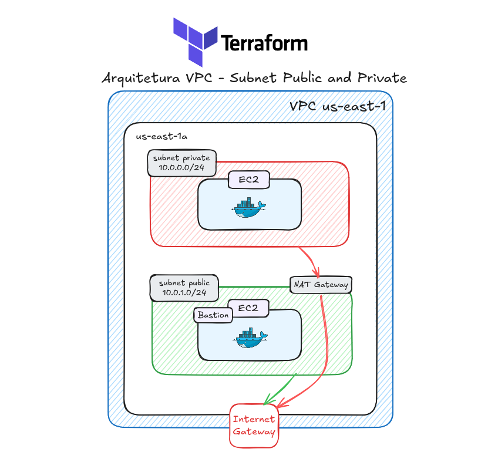

# VPC pública e privada com Terraform

Este repositório é um dos meus primeiros projetos usando Terraform. A ideia foi praticar a criação de uma rede na AWS com uma subnet pública e outra privada, além de provisionar uma instância EC2 em cada uma delas.

Usei a documentação do Terraform e da AWS, junto com exemplos, para entender como os recursos se relacionam e como organizá-los em módulos.

## Arquitetura do projeto



## O que o projeto cria

- Uma VPC com CIDR `10.0.0.0/16`.
- Uma subnet pública (`10.0.1.0/24`) e uma subnet privada (`10.0.0.0/24`), ambas na zona `us-east-1a`.
- Um Internet Gateway e tabelas de rotas para as subnets.
- Um NAT Gateway na subnet pública, para permitir que recursos na subnet privada iniciem conexões com a internet.
- Security groups separados para as instâncias pública e privada.
- Duas instâncias EC2 Ubuntu `t3.micro`, com Docker instalado no primeiro boot via `user_data`.

## Como a rede funciona

A subnet pública tem uma rota para o Internet Gateway e as instâncias nela podem receber um IP público. A subnet privada usa uma rota para o NAT Gateway. Assim, a instância privada pode acessar serviços externos, por exemplo para baixar pacotes, sem receber um IP público nem aceitar conexões iniciadas diretamente pela internet.

O NAT Gateway e o Elastic IP ficam na subnet pública. A instância privada não tem associação explícita de IP público.

A instância na subnet pública funciona como bastion host. Primeiro, conecto-me a ela e, a partir daí, acesso a instância na subnet privada.

## Estrutura dos arquivos

```text
.
├── provider.tf
├── modules.tf
├── network/
│   ├── vpc.tf
│   ├── subnet.tf
│   ├── igw.tf
│   ├── ngw.tf
│   ├── route-table.tf
│   ├── security-group-public.tf
│   ├── security-group-private.tf
│   ├── variables.tf
│   └── outputs.tf
└── instancia/
    ├── instancia.tf
    ├── variables.tf
    └── outputs.tf
```

- `provider.tf`: configura o provider AWS, a versão do provider e o backend remoto S3.
- `modules.tf`: instancia os módulos de rede e de EC2 e conecta seus inputs e outputs.
- `network/`: cria a VPC, subnets, gateways, rotas e security groups.
- `instancia/`: consulta o key pair existente e cria as instâncias com instalação de Docker no boot.

## O que pratiquei

Com este projeto pratiquei a declaração de recursos AWS com Terraform, a separação de infraestrutura em módulos, o uso de variáveis e outputs, tabelas de rotas e a relação entre subnets, gateways e security groups.

## Problemas encontrados

Ao acessar a instância na subnet privada, percebi que ela não conseguia acessar a internet. Conferi a rota da subnet e a configuração do NAT Gateway, que estavam corretas. Depois, revisei o Security Group e encontrei a causa: faltava uma regra de saída (egress) permitindo o tráfego necessário. Após adicioná-la, a instância passou a acessar a internet pelo NAT.